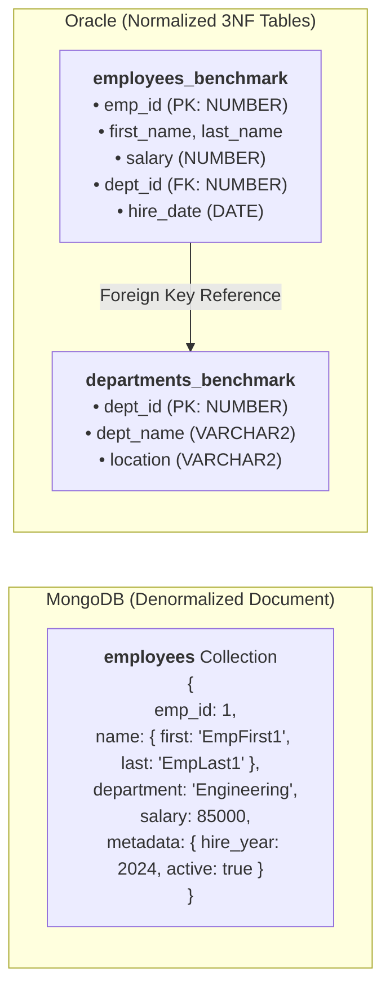

# ⚡ Database Benchmarking: MongoDB (NoSQL) vs. Oracle Database (RDBMS)

> **Database Systems Final Assignment**  
> An empirical performance evaluation comparing query latency, execution plans, and data modeling paradigms between **MongoDB** (document-oriented NoSQL) and **Oracle Database** (relational RDBMS) under a 50,000-record workload.

---

## 📌 Executive Summary

Modern enterprise software architectures frequently require selecting between flexible, document-centric persistence and strongly normalized relational data stores. This project benchmarks:
- **Bulk data ingestion efficiency** across 50,000 synthetic records.
- **Query performance under full scan vs. indexed search** (Collection Scan / `COLLSCAN` vs. B-Tree `IXSCAN` in MongoDB; `TABLE ACCESS FULL` vs. `INDEX RANGE SCAN` in Oracle).
- **Embedded Document Aggregation** (MongoDB Aggregation Pipeline) vs. **Normalized Multi-Table Joins** (Oracle SQL `INNER JOIN` + `GROUP BY`).

---

## 🏗️ Architecture & Data Modeling Paradigm

| Dimension | MongoDB (NoSQL) | Oracle Database (RDBMS) |
| :--- | :--- | :--- |
| **Model Type** | Document Store (BSON / JSON) | Relational (Tables, Rows, Columns) |
| **Schema Design** | **Denormalized**: Nested objects (`name`) & embedded subdocuments (`metadata`) | **Normalized (3NF)**: Separated `departments_benchmark` & `employees_benchmark` |
| **Integrity Enforcement** | Application-level validation | Foreign Key constraints (`dept_id` references `departments_benchmark`) |
| **Indexing Mechanism** | Single-field B-Tree Index on `{ department: 1 }` | B-Tree Index on `idx_emp_dept(dept_id)` |
| **Execution Plan Inspector** | `.explain("executionStats")` | `EXPLAIN PLAN FOR` / `DBMS_XPLAN.DISPLAY` |



---

## 🧪 Benchmark Test Scenarios

### 1. Ingestion Phase (50,000 Records)
* **MongoDB (`Mongo_benchmark.js`)**: Leverages `initializeUnorderedBulkOp()` to batch-insert 50,000 structured documents with randomized departments (`HR`, `Engineering`, `Sales`, `Marketing`, `Finance`) and nested objects.
* **Oracle (`Oracle_Benchmark.sql`)**: Uses a PL/SQL anonymous block with `DBMS_RANDOM` to seed 50 departments and 50,000 employee records with relational integrity.

### 2. Test 1: Unoptimized Search (Full Scan)
* **MongoDB**: Executes `find({ department: "Engineering" })` on an unindexed collection, triggering a **`COLLSCAN`** (Collection Scan) requiring inspection of all 50,000 documents.
* **Oracle**: Executes `SELECT count(*) FROM employees_benchmark WHERE dept_id = 25`, requiring a **`TABLE ACCESS FULL`** (Full Table Scan) across all data blocks.

### 3. Test 2: Optimized Search (B-Tree Index)
* **MongoDB**: Applies an ascending index via `createIndex({ department: 1 })`. Re-running the query transitions execution to **`IXSCAN`**, examining only the subset of matching documents.
* **Oracle**: Builds a B-Tree index via `CREATE INDEX idx_emp_dept ON employees_benchmark(dept_id)`. The optimizer switches from FTS to **`INDEX RANGE SCAN`**.

### 4. Test 3: Aggregation vs. Relational Join
* **MongoDB**: Executes a multi-stage aggregation pipeline:
  ```javascript
  db.employees.aggregate([
      { $match: { "metadata.active": true } },
      { $group: { _id: "$department", avg_salary: { $avg: "$salary" } } },
      { $sort: { avg_salary: -1 } }
  ])
  ```
* **Oracle**: Performs a relational `INNER JOIN` with an aggregation clause:
  ```sql
  SELECT d.dept_name, AVG(e.salary) as avg_sal
  FROM employees_benchmark e
  JOIN departments_benchmark d ON e.dept_id = d.dept_id
  GROUP BY d.dept_name;
  ```

---

## 📊 Benchmark Results & Comparison

> *Tested on local benchmarking environment (50,000 synthetic records).*

| Benchmark Stage | Metric / Plan Operator | MongoDB (`mongosh`) | Oracle Database (`SQL*Plus`) |
| :--- | :--- | :--- | :--- |
| **Data Ingestion** | Ingestion Method | `UnorderedBulkOp` (Batch) | PL/SQL Loop (`DBMS_RANDOM`) |
| **Test 1: Unindexed Read** | Latency (ms) | *Baseline latency* | *Baseline latency* |
| | Execution Strategy | `COLLSCAN` (50,000 docs examined) | `TABLE ACCESS FULL` (All blocks scanned) |
| **Test 2: Indexed Read** | Latency (ms) | *Significant reduction* | *Significant reduction* |
| | Execution Strategy | `IXSCAN` (~10,000 keys examined) | `INDEX RANGE SCAN` (~1,000 keys examined) |
| | **Speedup Impact** | **Substantial latency drop** | **Substantial I/O & latency drop** |
| **Test 3: Aggregation / Join** | Strategy | Pipeline (`$match` $\rightarrow$ `$group` $\rightarrow$ `$sort`) | `HASH JOIN` / `MERGE JOIN` + `GROUP BY` |

---

## 🚀 How to Run the Benchmarks

### Prerequisites
- [MongoDB](https://www.mongodb.com/try/download/community) (v6.0+) with [`mongosh`](https://www.mongodb.com/try/download/shell) installed.
- [Oracle Database](https://www.oracle.com/database/) (Oracle Free 23c, 21c XE, or Autonomous DB) with [Oracle SQL Developer](https://www.oracle.com/database/sqldeveloper/), `sqlplus`, or `sqlcl`.

---

### Executing MongoDB Benchmark
Run directly using `mongosh`:
```bash
mongosh "mongodb://localhost:27017" < Mongo_benchmark.js
```
*Or copy the contents of [`Mongo_benchmark.js`](Mongo_benchmark.js) into MongoDB Compass / mongosh interactive terminal.*

---

### Executing Oracle Benchmark
Connect to your Oracle instance via `sqlplus` or SQL Developer:
```sql
-- Enable timing in SQL*Plus to capture elapsed query time
SET TIMING ON;
SET AUTOTRACE ON;

-- Execute benchmark script
@Oracle_Benchmark.sql
```

To view Oracle's Cost-Based Optimizer (CBO) execution plan:
```sql
EXPLAIN PLAN FOR
SELECT d.dept_name, AVG(e.salary) as avg_sal
FROM employees_benchmark e
JOIN departments_benchmark d ON e.dept_id = d.dept_id
GROUP BY d.dept_name;

SELECT * FROM TABLE(DBMS_XPLAN.DISPLAY);
```

---

## 💡 Key Architectural Insights

1. **Scan Cost vs Index Selectivity**:
   - In MongoDB, creating the B-Tree index on `department` eliminated scanning irrelevant documents, drastically lowering `totalDocsExamined`.
   - In Oracle, the index on `dept_id` allowed the query planner to bypass table-wide block scans and navigate directly to matching rowids via `INDEX RANGE SCAN`.
2. **Denormalization vs Normalized Joins**:
   - MongoDB excels when related attributes are co-located in a single document (reducing query complexity and avoiding multi-table joins).
   - Oracle provides strict referential integrity, strong typing, and ACID guarantees, utilizing its cost-based optimizer to efficiently handle complex multi-table joins via hash or sort-merge algorithms.

---

## 📁 Repository Structure

```text
├── Mongo_benchmark.js      # MongoDB 50k document generator, unindexed/indexed queries & aggregation
├── Oracle_Benchmark.sql    # Oracle 3NF schema, PL/SQL seeder, full-scan/index-scan & join queries
└── README.md               # Benchmark documentation & reproduction guide
```

---

## 👤 Author
- **Rean** ([@ignRean](https://github.com/ignRean))
